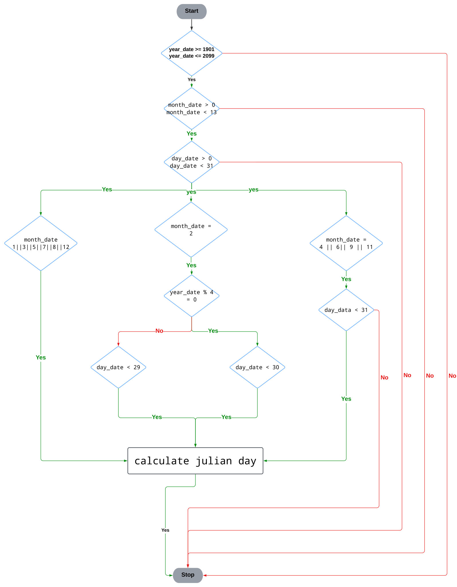

# Julian day number calculator
>
> Supervisor : DR.Ahmed badawy
>
> By : Ahmed khaled Fathy

## check if the all input are avilable

```python
year_date = int(input("Enter the year : "))
    if not (year_date >= 1901 and year_date <= 2099):
        raise ValueError (f"{year_date} is not valid . The Year should be between 1901 & 2099 ")

    month_date = int(input("Enter the month : "))
    if not (month_date >= 1 and month_date <= 12):
        raise ValueError (f"{month_date} is not valid . The month should be between 1 & 12")

    day_date = int(input("Enter the day : "))
    if not (day_date >= 1 and day_date <= 31):
        raise ValueError (f"{day_date} is not valid . The day should be between 1 & 31")
    
    x = month_date
    if ( x == 4  or x == 6 or x == 9 or x == 11 ) and day_date == 31:
        raise ValueError (f"Month {month_date} is just 30 day")
    elif  x == 2:
        if  day_date == 29 and year_date % 4 != 0 :
            raise ValueError (f"Month {month_date} is just 28 day")
        elif day_date > 29:
            raise ValueError (f"Month {month_date} is just 29 day")
        
```



## Get the julian day

$$ J_{o} = 367 {y} - \texttt{INT} \left\{ \frac {7 \left[ y + \texttt{INT} \left( \frac {m + 9}{12} \right) \right] }{4} \right\} + \texttt{INT} \left( \frac {275 \text{m}}{9} \right) + \text{d} + 1721013.5 $$
$$ \text{UT} = \text{h } + \frac{\text{m}}{60} + \frac{\text{s}}{3600} \texttt{ hour} $$
$$ \text{JD} = \text{J}_o + \frac{\text{UT}}{24}$$